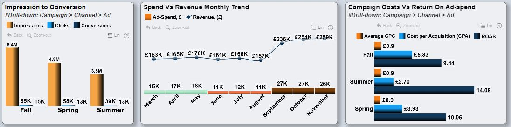
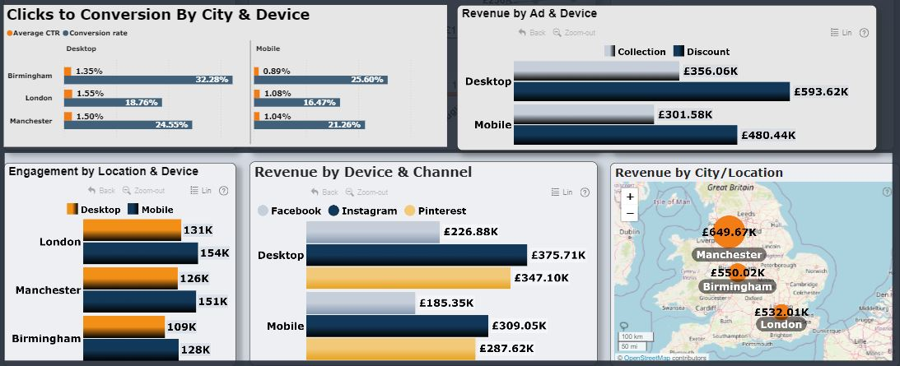

# Marketing Campaign Analysis  - UK Fashion Brand


[Photo Credit](https://create.microsoft.com/en-us/features/ai-image-generator)

## Background
A UK-based clothing store launched a series of targeted marketing campaigns for the **Spring, Fall, and summer** seasons. Each campaign included **two distinct advertisements** on **Facebook, Pinterest, and Instagram**: one highlighting _discount_ and the other showcasing the _latest clothing collections_. The campaigns specifically targeted three major cities: London, Birmingham, and Manchester. Daily performance metrics were meticulously captured across various dimensions, including cities, channels, devices, and individual ads. These metrics encompassed `Impressions`, `Click-Through Rate (CTR)`, `Clicks`, `Daily Average Cost-Per-Click (CPC)`, `Spend`, `Conversions`, `Total Conversion Value`, `Likes`, `Shares`, and `Comments` 


[Photo Credit](https://create.microsoft.com/en-us/features/ai-image-generator)

## About the Data
The dataset is a Microsoft Excel file that contains one table, consisting of **9,900 rows and 18 columns**, of the Daily performance metrics, of a Marketing Campaign data for a **UK Fashion brand**, carried out during 3 seasons in 2023 - Spring (March to May), Summer (June to August), and Fall (October to November). The dataset was gotten from [Onyx Data](https://onyxdata.ck.page/datadna-jun-2024).  

## Business Need 
A comprehensive Power BI report that:
-	Analyzes the Marketing Campaign performance metrics
-	Provides insights into the effectiveness of each campaign, and 
-	Identifies opportunities for optimization.
## Target Audience
-	Technical and Non-technical Business Users
## Skills/Concepts applied
-	Defining & Computing KPIs
-	Cleaning/Validation in Power Query
-	Power BI DAX Concepts: Calculated Measures
-	Data Visualization in Power BI
-	[Zoomcharts Drill-Down Visuals](https://zoomcharts.com/en/)  
-	Power BI Dashboard building
-	Filters and Slicers
- Bookmarks and Tooltips 
-	Microsoft PowerPoint (to enhance UI design & commentary)
## Defining Key Performance Indicators (KPIs)
The following metrics were identified as essential Key Performance Indicators (KPIs) to provide the business user with insights into the effectiveness of each campaign, and  Identify opportunities for optimization:

**Provided KPIs (Within the dataset)**
- _Impressions_ – Daily impressions (times ad was shown to a viewer) for each ad
- _CTR (%)_ - Daily average click-through rate for each ad
- _Clicks_ - Daily clicks for each ad
- _Daily Average CPC_ - Daily average cost-per-click for each ad
- _Spend, GBP_ - Total daily amount of advertising spending for each ad, in Great Britain Pounds(GBP)
- _Conversions_ - Total daily purchases attributed to a specific ad
- _Total Conversion Value, GBP_ - Total amount received from purchases attributed to a specific ad (Revenue)
- _Likes_ - Total daily likes (or other reactions) per ad
- _Shares_ - Total daily shares per ad (For the simplicities sake, each Pin on Pinterest was counted as a share)
- _Comments_  - Total daily comments per ad


**Additional(computed) KPIs.**
- Total Engagement - _What is the overall level of user interaction or engagement with our Ads across different metrics (likes, shares, and comments)?_
- Conversion rate (%) - _What percentage of ad viewers are converting into Paying customers?_
- Cost per Acquisition - _How much does it cost to acquire a single customer?_
- Return on Ad-spend (ROAS) - _How much revenue is generated for every dollar spent on advertising?_
- Return on Investment (ROI) (%) - _How much profit or loss is generated from our investment relative to its cost?_
- Monetary ROI (£) - _What is the net financial return (in monetary terms) on our investment after accounting for all costs and revenues?_

## Data Transformation/Preprocessing
The dataset was imported into Power BI’s Power Query for data validation and cleaning.  The column profiling was changed from ‘based on Top 1000 rows’ to ‘based on entire dataset’. ‘Column quality’ and ‘Column distribution’ checkboxes were selected to get a summary information about each column for effective cleaning/Preprocessing. The data table was fairly clean and required minimal transformation, which was carried out as follows:
- Column datatypes were validated appropriately - the data types of Impressions, Clicks and comments columns were changed from decimal to whole number. The data type of Click-through rate (CTR) column was changed from decimal to percentage.
- Columns that contain financial data such as the daily “Average CPC (cost-per-click) & Spend (GBP) Columns were rounded off to 2 decimal places, for consistency.
- There were no missing values, empty cells or duplicates
To enable flexibility of time-based analysis, a **Calendar Table** was then created in power query using the [M Query language](https://devinknightsql.com/2015/06/16/creating-a-date-dimension-with-power-query/) shown below: 
```
//Create Date Dimension
(StartDate as date, EndDate as date)=>
let
    //Capture the date range from the parameters
    StartDate = #date(Date.Year(StartDate), Date.Month(StartDate), Date.Day(StartDate)),
    EndDate = #date(Date.Year(EndDate), Date.Month(EndDate), Date.Day(EndDate)),
    //Get the number of dates that will be required for the table
    GetDateCount = Duration.Days(EndDate - StartDate) + 1,
    //Take the count of dates and turn it into a list of dates
    GetDateList = List.Dates(StartDate, GetDateCount, #duration(1,0,0,0)),
    //Convert the list into a table
    DateListToTable = Table.FromList(GetDateList, Splitter.SplitByNothing(), {"Date"}, null, ExtraValues.Error),
    //Add Year Column
    YearNumber = Table.AddColumn(DateListToTable, "Year", each Date.Year([Date])),
    //Add Quarter Column
         QuarterNumber = Table.AddColumn(YearNumber , "Quarter", each "Q" & 	Number.ToText(Date.QuarterOfYear([Date]))),
     //Add Week Number Column
    WeekNumber= Table.AddColumn(QuarterNumber , "Week Number", each Date.WeekOfYear([Date])),
    //Add Month Number Column
    MonthNumber = Table.AddColumn(WeekNumber, "Month Number", each Date.Month([Date])),
    //Add Month Name Column
    MonthName = Table.AddColumn(MonthNumber , "Month", each Date.ToText([Date],"MMMM")),
    //Add Day Column
    DayNumber = Table.AddColumn(MonthName , "Day", each Date.Day([Date])),
    //Add Day of Week Column
    DayOfWeek = Table.AddColumn(DayNumber , "Day of Week", each Date.ToText([Date],"dddd"))
in
   DayOfWeek
```
An additional table was created to house the social media Channels’ image URL to enhance the visual appeal of the final dashboard.
## Data Modelling
The Model from the cleaned data is a **basic Star Schema** comprising of:
one fact table (the data table) and two, dimension tables (Calendar & Image). The `date` column from the Marketing data table was connected to the `date` column in the calendar table, via a Many-to-one relationship while the `channel` column from the Marketing data table was connected to the `Channel` column in the image table, via a Many-to-one relationship. This is shown in the image below:


## Data Exploration (EDA)
With the data now transformed and modelled, it’s time to explore the data to analyze the Marketing Campaign performance metrics, in order to provide insights into the effectiveness of each campaign, and Identify opportunities for optimization, in response to the Business need. 

I approached the analysis by segmenting it into 3 Levels – **Campaign, Channel and Ad performance**, with filters, slicers and tooltips to enable interactivity and drill-down into other categories such as Cities, device, and Month. 
The metrics were then analyzed & summarized within 3 areas – **Engagement, Revenue generated and Cost Analysis**. To analyze **Engagement performance** of the campaign, the following DAX Measures were created:
```
Total Ads = COUNTROWS('data') 
```
```
Total Clicks = SUM('data'[Clicks])
```
```
Average CTR = AVERAGE('data'[CTR, %])
```
```
Total Impressions = SUM('data'[Impressions])
```
```
Total Likes = SUM('data'[Likes (Reactions)])
```
```
Total Shares = SUM('data'[Shares])
```
```
Total Comments = SUM('data'[Comments])
```
To analyze **revenue and cost** aspects of the campaign, the following DAX Measures were created-

Cost Analysis measures:
```
Total Ad Spend = SUM('data'[Spend, GBP])
```
```
Average CPC = AVERAGE('data'[Daily Average CPC])
```
```
Total Conversions = SUM('data'[Conversions])
```
```
Conversion rate = DIVIDE([Total Conversions],[Total Clicks])
```
```
Cost per Acquisition (CPA) = DIVIDE('_Metrics'[Total Ad Spend],'_Metrics'[Total Conversions])
```
Revenue Analysis Measures:
```
Total Conversion Value (£) = SUM('data'[Total conversion value, GBP])
(Conversion Value ≈ Revenue)
```
```
Return On Ad-spend = DIVIDE([Total Conversion Value (£)],[Total Ad Spend])
```
```
Return-On-Investment (ROI) = 
VAR TotalRevenue = SUM('data'[Total conversion value, GBP])
VAR TotalSpend = SUM('data'[Spend, GBP])
RETURN
IF(
    TotalSpend <> 0,
    (TotalRevenue - TotalSpend) / TotalSpend,
    BLANK()
)
```
```
Monetary ROI = 
    VAR _Profit = SUMX(
        'data', 
        [Total conversion value, GBP] - [Total Ad Spend]
    )
    VAR _MonetaryROI = 
        IF(
            SUMX(
                'data',
                [Total Ad Spend]
            ) = 0,
            BLANK(), // Handle division by zero error
            _Profit
        )
    RETURN _MonetaryROI
```
With the measures for the metrics computed, it’s time to bring our analysis to life with visuals. 

## KPI Visualization/Presentation (WIP)
Our Fashion brand needed to increase its revenue while staying above the competition. We thought, in our current digital global village, what other way than a digital marketing campaign - **3 Seasons, Endless Style**😉.  Every weather season has an attire for it, and so we launched into the deep. 

However, we needed to carry out a test-run, before a larger global based campaign. Thus, during 3 different Seasons (Fall, Spring & Summer), we Launched 2 Advert types (Discounts & Latest collections) across 3 social media channels - Facebook, Instagram and Pinterest, with a focus on 3 cities- Birmingham, Manchester and London. We also made room to understand the devices used to access the Ads, to help our design team in digital Ad design & deployment.

To begin, Let’s see how the campaigns performed on a general level.


From the above visual, we see that a total of 9,900 Ads was launched (3,300 Ads per campaign season), resulting in 14.65 million impressions and over 180,000 clicks with an average Click-through rate (CTR) of 1.23%. Wow!😃 that was an impressive social reach. 
Nevertheless, having spent a total of £163.25K on the Ads we needed to see how the engagement translated to conversions, which is a driver for the revenue to be gotten.

Analyzing further, we see that the over 180,000 clicks resulted in a little over 40,000 conversions, an indication that our conversion rate was about 22%. 

Now the question is, **How much did we make from these conversions?**

The visual shows that we made 1.73 million pounds (£1.73M) with a Return on Ad-Spend (ROAS) of 10.61. That means the Overall campaign generated over £10 for every £1 spent on ads. Hmm 🙂, this was generally a profitable campaign outcome. 

However, it will be beneficial to dive deeper and see a more granular information on the performance by campaigns, Channels and Ads as well as our cities and our users’ devices.

Moving to the Campaigns, we see from the image below that highest impression to conversion was recorded during Fall season. 
This high conversion is a likely reason for high revenue generated during the same season (September to November), as shown in our monthly trend analysis.



However, in terms of cost analysis, we see that despite having the highest Ad-spend and Cost per Acquisition, the fall season had the lowest Return on Ad-Spend (ROAS) across the campaign season. 

Thus, our analysis shows that, the **most effective Campaign** was in **Summer** (June to August), which was characterized by: 
- **lowest Ad-spend** - Less expense on Ad campaigns
- **low cost-per-acquisition (CPA)**, indicating that the brand is acquiring customers or conversions at a relatively low cost, and
- **A High Return on Ad Spend (ROAS)**, which indicates that the revenue generated from those acquisitions is significantly higher than the cost.


So, **What are the opportunities from the campaign seasons outcomes?**
- **The Summer Campaign indicates an opportunity to scale**. By scaling the ad spend, we can:- Reach more potential customers, Drive more conversions, and Increase revenue. With the low CPA , scaling the ad spend is likely to remain cost-effective, and the high ROAS indicates that the increased spend will likely lead to even more revenue growth.
- Conversely, **the Fall Campaign presents an opportunity to optimize** – It had the highest Ad-Spend and CPA, yet with the lowest ROAS.
- Similarly, **The Spring Campaign also indicates an opportunity to optimize**,  given its moderate Ad-spend and good ROAS.

Moving on, we look at our performance/opportunities across the 3 cities and based on device usage.


From the visual above, we see that across the cities, the **highest engagement was observed in London**, with highest engagement coming from mobile device users. A similar trend was also seen in Manchester and Birmingham, with mobile Engagement consistently outpacing desktop. 

_**So, Did the high engagement in London and among the mobile devices translate to conversions and revenue?**_ 🤔 Let's find out.



From the visual above, **Birmingham showed the highest clicks and conversion rate**, suggesting it is highly effective at turning interest into purchases, While **Manchester**, despite lower engagement and click, **generated the highest revenue**, indicating effective campaigns. 
Across the devices, highest conversions and revenue came from our Desktop users, rather than Mobile. This was recorded across the channels and campaigns alike.

_**What should be done?**_    

- The **highest engagement was observed in London**
→ This indicates a strong interest that can be leveraged to drive more clicks and conversions by refining ad content with compelling calls to action.     
- **Birmingham showed the highest clicks and conversion rate**, suggesting it is highly effective at turning interest into purchases.    
→ Allocating more budget to Birmingham could maximize conversions.
- **Manchester**, despite lower engagement and click, **generated the highest revenue**, indicating effective campaigns.     
→ Analyzing successful strategies in Manchester and replicating them in other locations could further enhance performance.
 
**For the Devices:**
- **Desktop ads** outperformed mobile in terms of click-to-conversion rate and revenue. This suggests maintaining a strong focus on desktop-targeted campaigns, with high-quality, detailed ad content optimized for larger screens.

- Mobile performance can be improved by ensuring ads are mobile-optimized, with responsive design and faster load times. Introducing mobile-specific promotions and enhancing the mobile user experience could boost engagement and conversions, helping to capture a broader audience effectively.
  
Now, Let’s consider the performance across the channels.


The ads were posted on 3 social media channels – **Facebook, Instagram and Pinterest**.  
With about **5.4million post reach (Impressions), 70,000 clicks, and highest likes & shares** as shown in the visual above, it seemed as though everyone was accessing the campaign through **Facebook**. However, this didn’t translate to needed revenue, as the lowest conversion rate(18.77%) and Return on Ad-Spend (ROAS) (5.76) among the channels was from Facebook.

**So, what about other 2 channels - _Instagram and Pinterest_.**

Well, Our **Instagram** Users showed higher interest in the campaign offer than Facebook, having recorded the **highest number of conversions (15 thousand+) and highest revenue of over £684,000**. Wow! that’s great. 😀

**Now, where is Pinterest in all of this?** 🤔

Interestingly, despite having the lowest engagement and Click-through rate (CTR), **Pinterest had the highest conversation rate(26.83%) and highest Return on Ad-Spend (ROAS) (22.47)** among the channels. 

Additionally, I carried out cost analysis to evaluate how efficient our investment in the 3 channels were.


From the above visual, the average Cost-per-Click (CPC) for _Facebook_ is £1.04, and the cost per acquisition (CPA) is £5.45, which is relatively high; and despite having the largest Ad-spend, it had the lowest Profit/Return-On investment (ROI). 

_Instagram_, on the other hand, had the highest Revenue & Profit/Return-On investment (ROI). With a CPC of £1.00, CPA is £4.07, and an Ad-Spend slightly lower than Facebook's, it generated a ROI of £621.37K. 

_Pinterest_ is seen to be the most cost-effective across the channels - despite having the lowest Ad-spend of £28.24K , it was the next best in terms of revenue and ROI, having generated a Profit/Return-On investment (ROI) of £606.47K

**_Alright, what’s our takeaway from this? What are the opportunities to scale/optimize?_**


Here’s what we can do:

**For Facebook**: 
-	Improve conversion rate and ROAS by refining ad targeting and testing new creatives. 
-	Consider segmenting audiences further to identify high-intent users. 
  
**For Instagram**: 
-	Scale up Instagram campaigns by increasing the ad spend on high-performing ads. 
-	Leverage the high engagement rates by creating more interactive and visually appealing content. 
-	Additionally, use Instagram Stories and Reels to tap into a wider audience and boost conversions.
  
**For Pinterest**: Pinterest's strong conversion performance indicates a high potential for scalable growth with increased investment, thus:
-	Significantly increase the ad spend on Pinterest campaigns. 
-	Focus on scaling successful ad formats and targeting strategies. 
-	Consider expanding to new audience segments and utilizing promoted pins to enhance visibility

It’s now time to evaluate the 2 Ad categories – _**Discount and Latest collection**_


Among the 2 Ads used for the campaign, we see from the visual above that Discount ads lead in overall engagement metrics, including likes and Comments. However, Collection ads have more clicks despite having fewer conversions and lower Return on Ad-Spend. Discount ads have a lower CTR but a significantly higher conversion rate and ROAS compared to Collection ads.


In terms of Cost analysis,  the visual above shows that Collection ads are slightly more cost-effective in terms of Cost Per Acquisition (CPA) and Cost-Per-Click (CPC) compared to Discount ads. Although Discount ads have a higher ad spend, they yield a significantly higher return on investment (ROI) in terms of monetary value compared to Collection ads.

_**How do we Improve on the Ads?**_

There are opportunities for optimization/Scaling based on the Ads performance:

**For Discount Ads:**

_Strength_: **High conversion rate and ROAS** indicate strong performance in converting clicks to revenue.

**Opportunity**:
-	 Increase the ad spend for Discount ads to capitalize on the high conversion efficiency. 
-	Enhance targeting strategies to further improve CTR and engagement, especially leveraging the high like and share rates.
  
**For Collection Ads:**

_Strength_: **Higher CTR** indicates effective ad appeal and relevance to the audience.

**Opportunity**: 
-	Focus on improving the conversion rate by refining landing pages and checkout processes. 
-	Consider optimizing ad creatives to maintain high engagement while driving more conversions. 
-	Test variations in ad copy and visuals to determine the best-performing combinations.

## Dashboard:
Having analyzed and visualized the required KPIs, [the interactive dashboard](https://drive.google.com/file/d/183meWryadUq3g8mQXwtJkX1uKptRkzvq/view?usp=sharing), with Image shown below, was then designed with slicers, tooltips and bookmarks to enable the business user drill down and gain additional insights from the report. A brief video guide of the dashboard can also be accessed through this [link](https://drive.google.com/file/d/1ksyEqHmqp5qyN-NQhzaSSTBv6_M0o5_f/view?usp=sharing)


## Conclusion (WIP)
In Summary, Consideration should be given to _shifting budget from underperforming areas to high perfoming areas_ to optimize overall campaign performance. 
One way to do this will be by **reallocating budget to top-performing ads like discounts, and channels like Pinterest & Instagram.**


